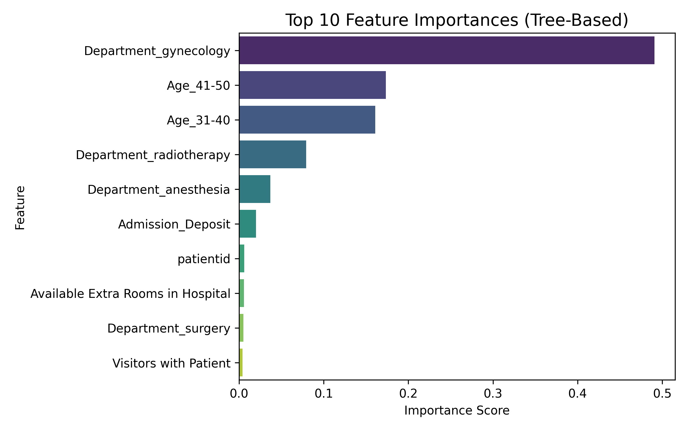

# Hospital Length of Stay (LOS) — Prediction & Dashboard

An end-to-end ML pipeline + **Streamlit** dashboard to predict **Length of Stay** at admission, evaluate **bin-wise bias** (≤7, 8–14, >14 days), and present **clinician-friendly** visuals.

---

## 🔎 Why it matters
Hospitals plan beds, staffing, and discharge flow around LOS. This project turns messy, real-world data into **actionable predictions** with **simple visuals** clinicians can use.

---

## 📈 Key Results (held-out)
- **R² ≈ 0.97**, **MAE ≈ 0.89 days**, **RMSE ≈ 1.32** (Random Forest)
- **Strongest performance in 8–14 days**; short stays (≤7) tend to be pulled upward (skew → “shrink-to-middle”)
- **Binned accuracy ≈ 0.80–0.90** (≤7, 8–14, >14 days)

> **Headline:** **The model correctly predicts the right LOS category ~80–90% of the time.**

---

## 🧭 Repository Guide
- **Dashboard (PDF):** [`docs/dashboard.pdf`](docs/dashboard.pdf)
- **EDA Findings (PDF):** [`docs/eda_findings.pdf`](docs/eda_findings.pdf)
- **EDA + Modeling Notebook:** [`notebooks/01_eda_modeling.ipynb`](notebooks/01_eda_modeling.ipynb)
- **Plots (PNGs used in README/app):** [`plots/`](plots/)

### Dashboard Preview (click to open PDF)
[](docs/hospital-los-prediction-dashboard/docs/Hospital Length Of Stay (LOS) Prediction PDF.pdf)

---

## ⚖️ Model Bias Evaluation (Binned LOS)
LOS is highly **skewed**. We evaluate performance in **clinically meaningful bins** (≤7, 8–14, >14 days) to expose hidden bias (e.g., short stays under-recalled) and keep results **fair and interpretable** for planning.

---

## 🧠 Top Predictors
- **Department (gynecology)** and **age bands (31–40, 41–50)** are strong drivers
- **Operational/financial** factors (admission deposit, available rooms) also contribute

---

## 💡 Business Recommendation
Allocate resources **by LOS category**:
- **≤7 days:** streamline rapid turnover (beds, discharges, same-day coverage)
- **8–14 days:** prioritize staffing & beds—this is the **largest group**
- **>14 days:** plan for variability—specialized units and extended resources

Together, EDA + modeling provide a **practical, data-driven basis** for capacity, staffing, and discharge planning.

---

## ▶️ Run the app
```bash
# 1) env
Set-ExecutionPolicy -ExecutionPolicy RemoteSigned -Scope Process # Windows

# 2) deps
pip install -r requirements.txt

# 3) launch
streamlit run dashboard.py
